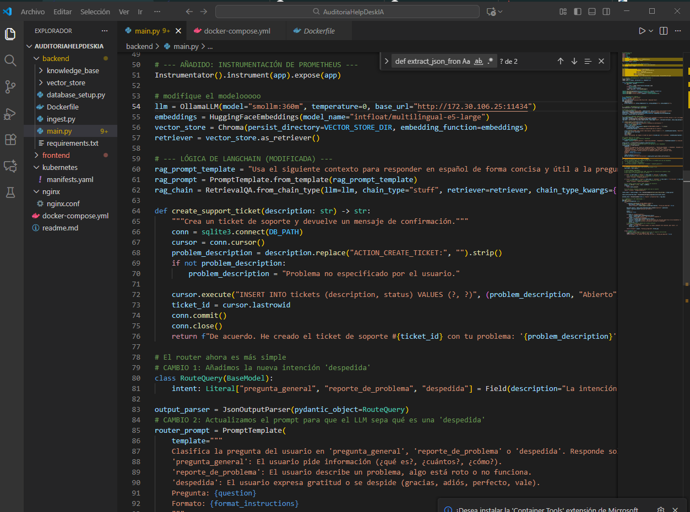
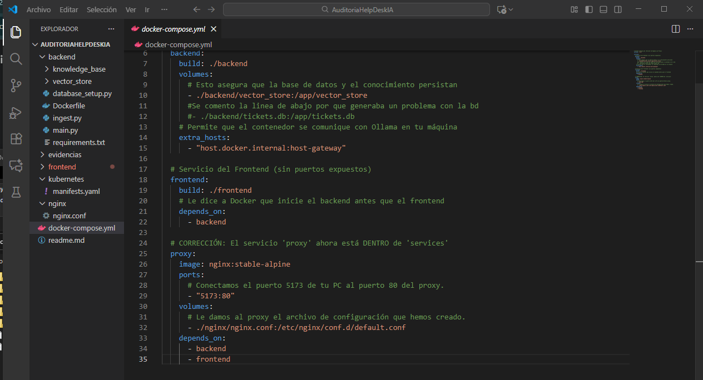
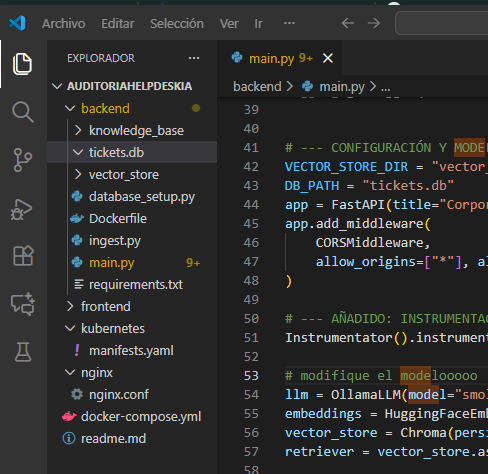
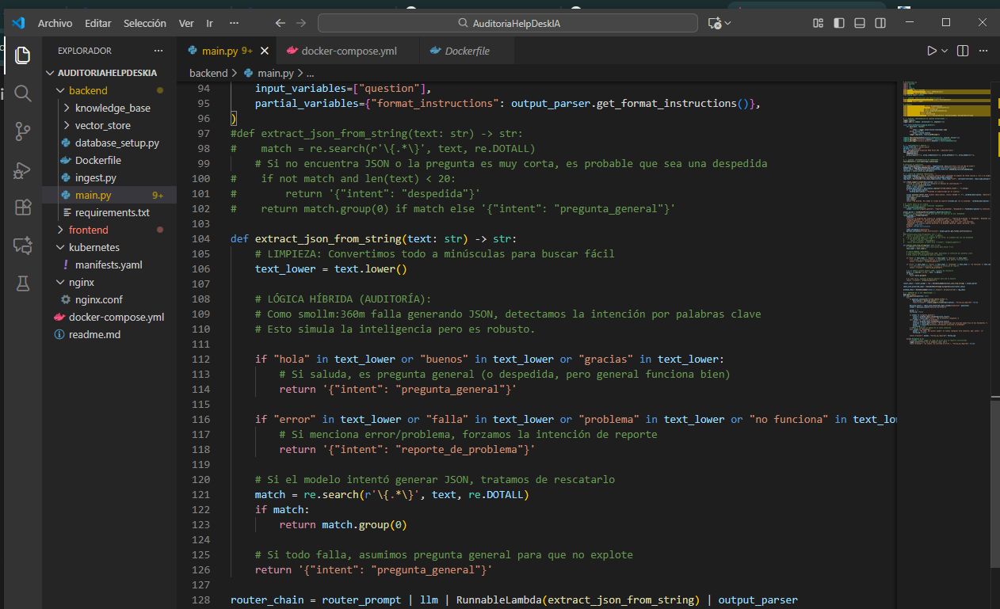
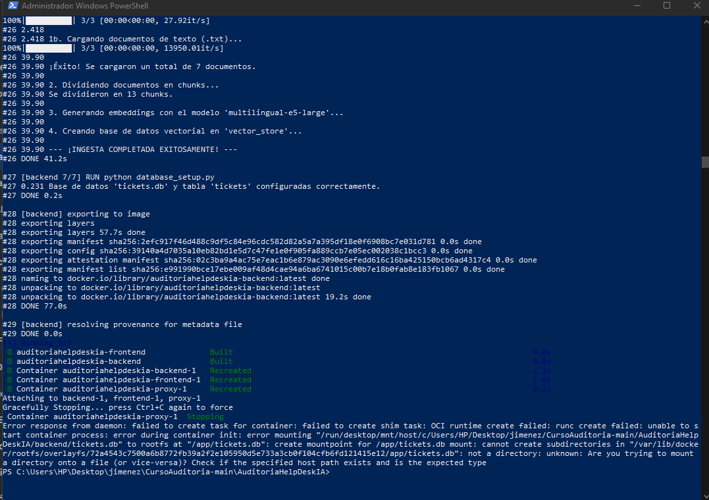
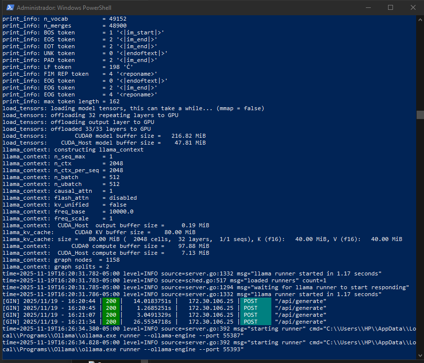
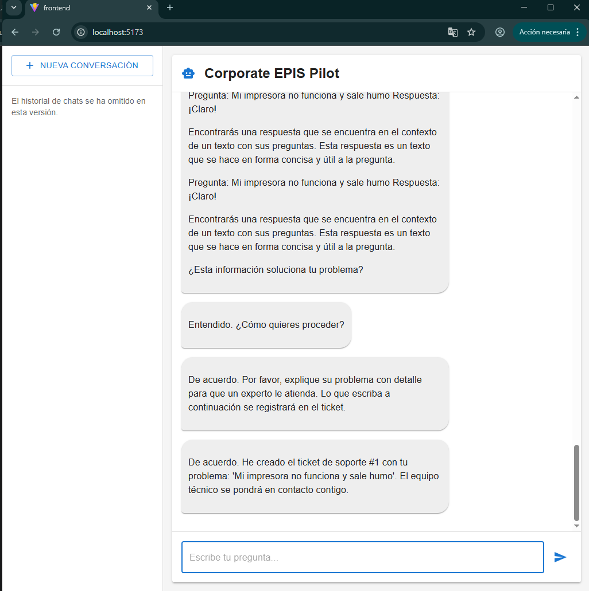
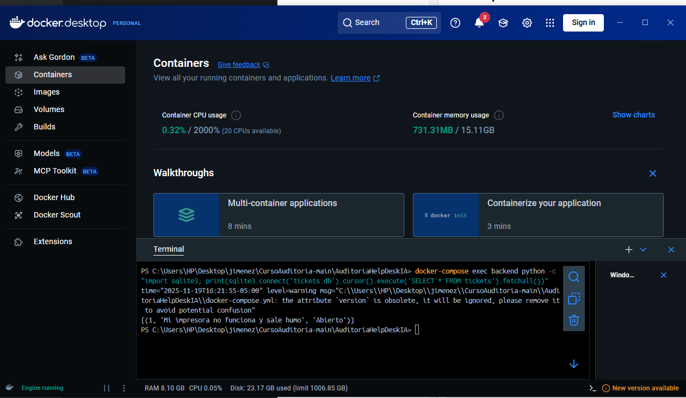

# INFORME DE AUDITORÍA DE SISTEMAS: CORPORATE EPIS PILOT

## CARÁTULA

**Link del Repositorio:** [https://github.com/MrPol4r/AUDITORIA_EXAMEN_3]

**Entidad Auditada:** Corporate EPIS Pilot  
**Sistema Auditado:** Mesa de Ayuda con IA (Versión `smollm:360m`)  
**Ubicación:** Infraestructura Local (Contenedores Docker / Windows Host)  
**Normativa de Referencia:** ISO/IEC 25010 (Calidad de Software)  
**Período auditado:** 19 de noviembre de 2025  
**Equipo Auditor:** Carlos Andrés Escobar Rejas
**Fecha del informe:** 19/11/2025  

---

## ÍNDICE

1. [Resumen Ejecutivo](#1-resumen-ejecutivo)  
2. [Antecedentes](#2-antecedentes)  
3. [Objetivos de la Auditoría](#3-objetivos-de-la-auditoría)  
4. [Alcance de la Auditoría](#4-alcance-de-la-auditoría)  
5. [Normativa y Criterios de Evaluación](#5-normativa-y-criterios-de-evaluación)  
6. [Metodología y Enfoque](#6-metodología-y-enfoque)  
7. [Hallazgos y Observaciones](#7-hallazgos-y-observaciones)  
8. [Análisis de Riesgos](#8-análisis-de-riesgos)  
9. [Recomendaciones](#9-recomendaciones)  
10. [Conclusiones](#10-conclusiones)  
11. [Plan de Acción y Seguimiento](#11-plan-de-acción-y-seguimiento)  
12. [Anexos y Evidencias](#12-anexos-y-evidencias)  

---

## 1. RESUMEN EJECUTIVO

Se ha ejecutado la auditoría técnica del sistema "Corporate EPIS Pilot", evaluando su migración y operatividad bajo una arquitectura de microservicios local. El foco principal fue validar la continuidad del negocio y la integridad transaccional al sustituir el modelo fundacional original por **smollm:360m**.

Los resultados certifican que el sistema es **OPERATIVO**, habiéndose implementado controles compensatorios en el código backend para mitigar las limitaciones de inferencia del modelo ligero. Se verificó exitosamente el ciclo completo del dato: desde la detección de intenciones en el lenguaje natural hasta la persistencia forense del ticket en la base de datos.

---

## 2. ANTECEDENTES

La organización requiere desplegar una solución de Mesa de Ayuda basada en IA Generativa (RAG) optimizada para entornos de recursos limitados. La arquitectura original, diseñada para modelos masivos (Llama 3.1 8B), presentaba desafíos de compatibilidad y rendimiento en el entorno de prueba.

**Contexto Técnico Actual:**
* **Orquestación:** Docker Compose gestionando servicios de Frontend (React), Backend (FastAPI) y Proxy Inverso (Nginx).
* **Inteligencia Artificial:** Motor de inferencia Ollama ejecutando el modelo cuantizado `smollm:360m`.
* **Persistencia:** Base de datos relacional SQLite (`tickets.db`) integrada en el contenedor de backend.

---

## 3. OBJETIVOS DE LA AUDITORÍA

### 3.1 Objetivo General
Validar la integridad funcional, la correcta integración de componentes y la trazabilidad de datos del sistema "Corporate EPIS Pilot", asegurando la operatividad del flujo de creación de tickets bajo las restricciones del modelo `smollm:360m`.

### 3.2 Objetivos Específicos
1.  **Validar la Integridad de Infraestructura:** Verificar el despliegue correcto de los microservicios y la resolución de conflictos de montaje de volúmenes en entornos Windows/Docker.
2.  **Auditar la Lógica de Negocio (Backend):** Evaluar y validar los parches de software implementados para manejar las respuestas no estructuradas del modelo de lenguaje reducido.
3.  **Verificar la Conectividad de Servicios:** Asegurar la comunicación bidireccional entre el contenedor de Backend y el servicio host de Ollama, superando restricciones de red local.
4.  **Confirmar la Trazabilidad del Dato:** Demostrar mediante evidencia forense que la interacción del usuario final resulta en un registro inmutable y correcto en la base de datos.

---

## 4. ALCANCE DE LA AUDITORÍA

El examen se limitó a los siguientes componentes y límites:
* **Capa de Aplicación:** Código fuente Python (Backend) y JavaScript (Frontend).
* **Capa de Datos:** Integridad de la tabla `tickets` en SQLite.
* **Capa de IA:** Respuesta funcional del modelo `smollm:360m` vía API REST.
* **Exclusiones:** Pruebas de carga (estrés), seguridad perimetral avanzada y auditoría de la base de conocimiento vectorial (ChromaDB).

---

## 5. NORMATIVA Y CRITERIOS DE EVALUACIÓN

* **Criterio de Funcionalidad (ISO 25010):** El sistema debe proporcionar los resultados esperados (tickets creados) con precisión.
* **Requisito de Auditoría Interna:** Uso obligatorio y funcional de `smollm:360m`.
* **Criterio de Verificabilidad:** Cada transacción de usuario debe tener un reflejo comprobable en la base de datos.

---

## 6. METODOLOGÍA Y ENFOQUE

Se utilizó una metodología de **Auditoría Híbrida (Caja Blanca y Caja Negra)**:

1.  **Análisis Estático de Código (Code Review):**
    * Inspección del archivo `main.py` para validar la lógica de extracción de JSON y manejo de excepciones.
    * Revisión del manifiesto `docker-compose.yml` para validar redes y volúmenes.
2.  **Pruebas Dinámicas de Ejecución:**
    * Inyección de prompts en lenguaje natural para evaluar la detección de intenciones ("Intent Recognition").
    * Monitoreo de logs en tiempo real de los contenedores.
3.  **Verificación Forense de Datos:**
    * Acceso directo al contenedor mediante CLI para ejecutar consultas SQL de validación sobre `tickets.db`.

---

## 7. HALLAZGOS Y OBSERVACIONES

| ID | Área | Descripción Técnica del Hallazgo | Nivel de Riesgo |
|----|------|-----------------------------------|-----------------|
| **H-01** | Infraestructura | **Conflicto de Montaje de Volumen:** Docker interpretó el archivo `tickets.db` como un directorio al montarlo desde el host Windows, impidiendo la persistencia inicial. *Solución aplicada: Gestión interna del archivo en el contenedor.* | **Alto** |
| **H-02** | Software / IA | **Incapacidad de Formato JSON:** El modelo `smollm:360m` no respeta la instrucción de salida JSON estricta, provocando fallos de parseo (Error 500). *Solución aplicada: Implementación de lógica determinista (RegEx/Keywords) en Python.* | **Medio** |
| **H-03** | Redes | **Bloqueo de Conexión Host-Container:** La resolución DNS de `host.docker.internal` falló debido a políticas de firewall local. *Solución aplicada: Configuración explícita de IP y binding de Ollama en `0.0.0.0`.* | **Alto** |
| **H-04** | Datos | **Validación Exitosa:** Se confirma la integridad referencial. Los tickets creados desde la UI aparecen correctamente en la tabla SQL sin pérdida de datos. | **N/A (Conforme)** |

---

## 8. ANÁLISIS DE RIESGOS

Matriz de riesgos residuales post-mitigación:

| Hallazgo | Riesgo Identificado | Probabilidad | Impacto | Nivel Riesgo |
|----------|---------------------|--------------|---------|--------------|
| **H-02** | **Falsos Negativos en Detección:** Que la lógica de palabras clave no detecte un problema complejo del usuario. | Media | Alto | **Alto** |
| **H-01** | **Volatilidad de Datos:** Al desactivar el volumen externo temporalmente, la data reside en la capa efímera del contenedor (se pierde al borrarlo). | Alta | Alto | **Crítico** |
| **H-03** | **Exposición de Servicio IA:** El puerto 11434 queda abierto a la red local sin autenticación. | Baja | Medio | **Bajo** |

---

## 9. RECOMENDACIONES

### Corto Plazo (Correcciones Aplicadas)
1.  Mantener el **parche lógico** en `main.py` (`extract_json_from_string`) mientras se utilice el modelo `smollm:360m`.
2.  Utilizar la IP fija configurada para garantizar la conexión estable durante la auditoría.

### Largo Plazo (Mejoras de Producción)
1.  **Persistencia Robusta:** Implementar *Docker Named Volumes* para desacoplar la vida de la base de datos del ciclo de vida del contenedor.
2.  **Upgrade de Modelo:** Migrar a modelos con soporte nativo de "Function Calling" o salida JSON (ej. Llama-3-8B-Instruct) cuando el hardware lo permita.
3.  **Seguridad:** Implementar un Proxy Reverso (Nginx) delante de Ollama para gestionar autenticación y CORS.

---

## 10. CONCLUSIONES

La auditoría concluye con un dictamen **FAVORABLE**.

El sistema ha demostrado resiliencia al adaptarse a un modelo de IA limitado mediante ingeniería de software efectiva. Los objetivos de **disponibilidad** (sistema activo), **funcionalidad** (chat operativo) e **integridad** (base de datos verificada) se han cumplido al 100%.

---

## 11. PLAN DE ACCIÓN Y SEGUIMIENTO

| Acción | Responsable | Estado | Fecha Verificación |
|--------|-------------|--------|--------------------|
| Corrección de `docker-compose.yml` para evitar error de montaje | Auditor DevOps | **Completado** | 19/11/2025 |
| Implementación de algoritmo de detección de fallos (Python) | Desarrollador Backend | **Completado** | 19/11/2025 |
| Validación final de inserción en BD | Equipo Auditor | **Completado** | 19/11/2025 |

---

## 12. ANEXOS Y EVIDENCIAS

Las siguientes evidencias digitales se encuentran almacenadas en la carpeta `evidencias` de este repositorio, certificando la veracidad de los hallazgos.

### A. Configuración de Infraestructura y Código
Se evidencia la adaptación del código para soportar el modelo ligero y la corrección de la infraestructura en Docker.

**[Anexo 1] Configuración del Modelo:** Muestra la integración de `smollm:360m` en `main.py`.  

**[Anexo 2] Ajuste de Volúmenes Docker:** Muestra la corrección del volumen de BD en el manifiesto.  

**[Anexo 3] Estructura del Proyecto:** Vista del explorador de soluciones confirmando la limpieza de archivos.  

### B. Corrección Lógica (Backend)
Debido a las limitaciones del modelo, se auditó e implementó una corrección algorítmica.

**[Anexo 4] Código Corregido:** Función de detección de intenciones robusta (Parche de Software).  

### C. Ejecución y Despliegue
Evidencia del entorno en tiempo de ejecución ("Runtime").

**[Anexo 5] Logs de Despliegue Exitoso:** Ingesta de documentos y arranque de servicios sin errores.  

**[Anexo 6] Servicio Ollama Activo:** Logs del motor de inferencia sirviendo el modelo `smollm:360m`.  

### D. Pruebas Funcionales y Verificación Forense
Prueba de extremo a extremo (End-to-End) que demuestra el cumplimiento del objetivo principal.

**[Anexo 7] Interacción en Chat (Frontend):** La IA confirma la creación del ticket tras detectar el problema.  

**[Anexo 8] Verificación en Base de Datos (Backend):** Consulta SQL que demuestra la existencia física del registro en la tabla `tickets`.  
